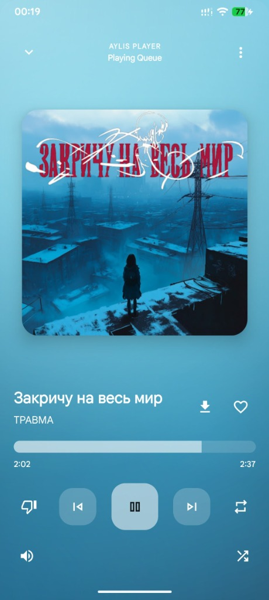
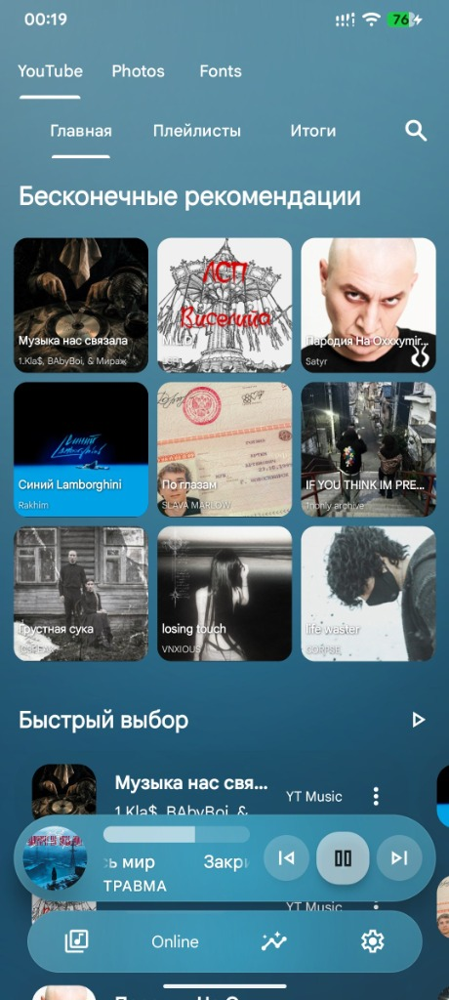
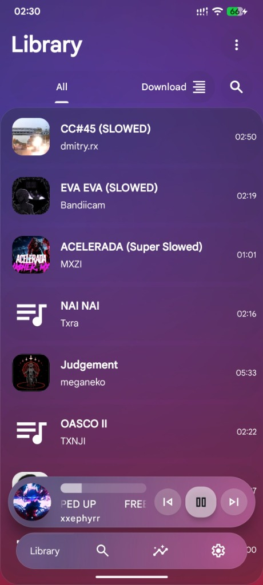
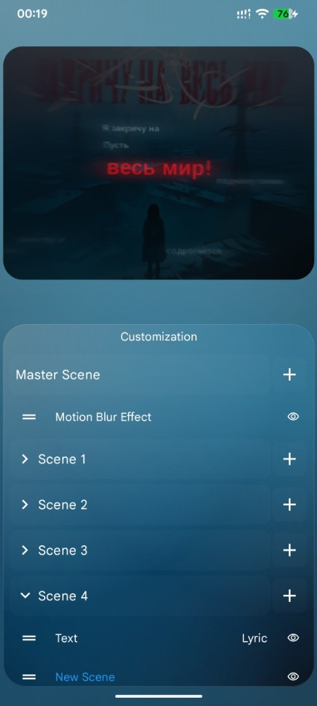
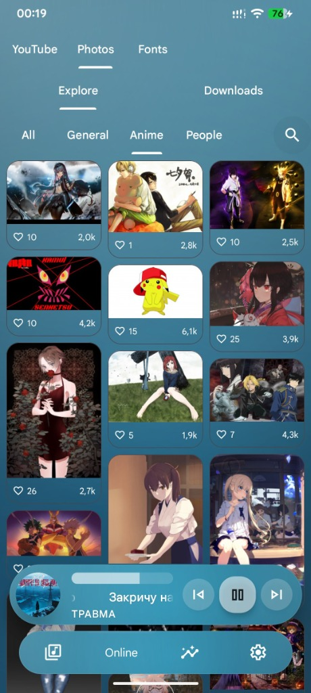
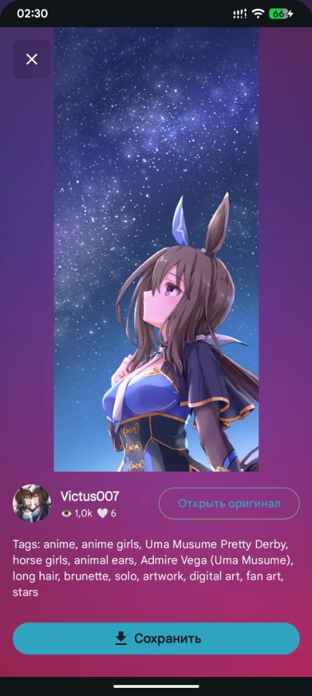
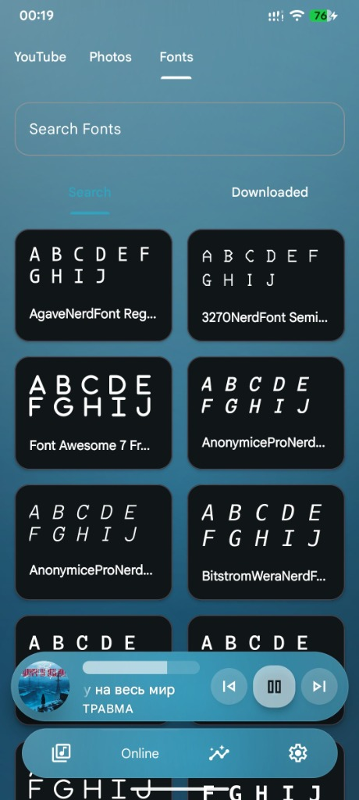

# AylisPlayer

An open-source, hybrid Android media player combining offline audio, online streaming, audio visualization, wallpaper feed, custom typography, and video export in a single Material 3 experience.

---

## 📸 Screenshots

<p align="center">
  
  
  
  
</p>
<p align="center">
  
  
  
</p>

---

##  Features

- **Hybrid Audio Engine**: Play local music files and stream online audio content (via NewPipeExtractor).
- **Audio Visualizer**: Real-time OpenGL & Canvas reactive audio visualizers with customizable spectrums, motion blur, and shaders.
- **Video Export**: Render and export playing audio tracks with visualizers into MP4 video files.
- **Ambient Lighting System**: Advanced ambient background glow with custom anchor points, brightness, and direction control across UI components.
- **Photo & Wallpaper Feed**: Discover, view, and download high-res artwork from Wallhaven.
- **Font & Typography Manager**: Download and apply custom typefaces to personalize the app interface.
- **Backup & Restore**: Export and import complete app settings safely.
- **In-App Updater**: Automatic update notifications directly via GitHub Releases.
- **Multi-Language**: Fully localized in English, Russian, Ukrainian, Portuguese (Brazil), and Vietnamese.

---

## Third-Party Libraries & Acknowledgements

This project uses and attributes the following open-source libraries, APIs, and base implementations:

| Project / Library | License | Description / Author | Link |
| :--- | :--- | :--- | :--- |
| **Avee Open Player** | Open Source | Original base codebase by Azy-Kun | [GitHub](https://github.com/Azy-Kun/AveeOpenPlayer_1.0.34) |
| **Google Media3 / ExoPlayer** | Apache 2.0 | Audio and video playback engine by Google | [GitHub](https://github.com/androidx/media) |
| **NewPipeExtractor** | GPL-3.0 | Online audio stream extraction by TeamNewPipe | [GitHub](https://github.com/TeamNewPipe/NewPipeExtractor) |
| **Glide** | BSD/MIT/Apache 2.0 | Media loading and caching library by Bumptech | [GitHub](https://github.com/bumptech/glide) |
| **Retrofit & OkHttp** | Apache 2.0 | HTTP client and networking stack by Square | [GitHub](https://github.com/square/okhttp) |
| **Moshi** | Apache 2.0 | JSON serialization library by Square | [GitHub](https://github.com/square/moshi) |
| **AnimatedBottomBar** | MIT | Custom bottom navigation interface | [GitHub](https://github.com/DroppingCircle/AnimatedBottomBar) |
| **Jaudiotagger** | LGPL | Audio metadata tagging library | [GitHub](https://github.com/ijabz/jaudiotagger) |
| **Wallhaven** | Service API | Wallpaper & photo discovery platform | [Wallhaven](https://wallhaven.cc) |
| **Cubiq (TheCubiq)** | Acknowledgement | Open-source contributor & graphics reference | [GitHub](https://github.com/TheCubiq) |

---

## 🚀 Building from Source

1. Clone the repository:
   ```bash
   git clone https://github.com/HeyHaku/AylisPlayer.git
   ```
2. Open in **Android Studio** (JDK 17+ recommended).
3. Build the debug APK:
   ```bash
   ./gradlew assembleDebug
   ```

---

## 📄 License

Distributed under the **GNU General Public License v3.0 (GPL-3.0)**. See `LICENSE` and `NOTICE` files for details.

---

OffTopic
---
Keywords: android music player, audio visualizer, video export, wallhaven wallpaper downloader, font manager, material 3, open source android player, ambient lighting, offline player, streaming player, music visualizer, opengl es visualizer, glsl shaders, real-time audio spectrum, synced lyrics, lrc lyrics parser, particle system visualizer, audio reactive visuals, multi-layer visualizer, hardware accelerated rendering, custom shader engine, local media library, tag editor, metadata editor, high resolution audio, gapless playback, background audio playback, material expressive, dynamic theming, monet theme engine, ambient glow ui, modern android ui, custom ui layout, dark theme music player, wallpaper hub, nerd fonts downloader, typography manager, visualizer presets, custom backgrounds, live video background, privacy friendly player, no ads music player, open source audio, video renderer, android visualizer app, audio reactive animations, custom fonts.